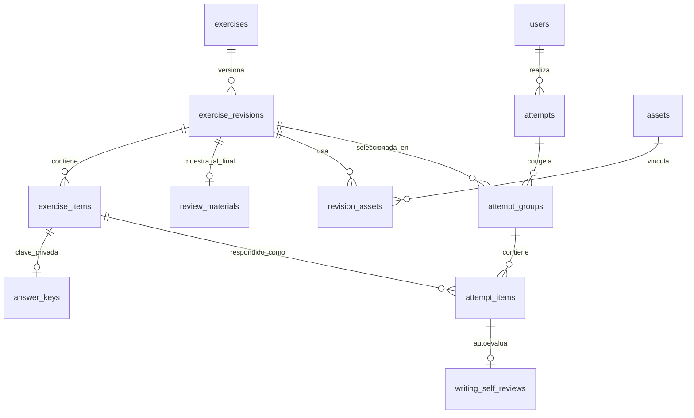

# MVP y modelo de datos para una plataforma de práctica TOEFL

Fecha: 23 de septiembre de 2026. Documento de decisión para construir una primera versión. Parte del [análisis funcional de KMF](./especificacion-funcional-toefl.md) como referencia de comportamiento. Los ejercicios, audios, explicaciones y diseño visual del producto serán originales.

## Decisión de alcance

El MVP debe demostrar un ciclo completo: **elegir práctica → responder → guardar o reanudar → entregar → revisar resultados → repetir**. Incluye cinco de las diez familias documentadas:

| Tipo | Entra en el MVP | Motivo |
|---|---|---|
| R1 — completar palabras | Sí | Valida un material con muchos huecos puntuables. |
| R3 — lectura académica | Sí | Establece el lector de pasajes y preguntas de opción única; sirve de base para R2. |
| L2 — conversación breve | Sí | Prueba audio, fase de escucha, varias preguntas y reloj por pregunta; sirve de base para L1, L3 y L4. |
| W1 — construir una oración | Sí | Introduce una interacción propia de Writing que se corrige de forma objetiva. |
| W2 — redactar un correo | Sí | Prueba editor, contador de palabras, borradores y entrega sin fingir una nota lingüística. |

R2, L1, L3, L4 y W3 quedan para la siguiente entrega. Sus datos encajan en el mismo esquema; **no se implementan sus pantallas ni se cargan ejercicios en el MVP**. Speaking, simulacros oficiales, puntuación TOEFL, adaptación de dificultad, pagos, membresías, IA evaluadora, favoritos, notas y cursos también quedan fuera.

El recorte respecto de la sección «Primera versión» de la especificación funcional es deliberado. Cinco tipos obligan a resolver los cuatro patrones difíciles —huecos, elección, audio y texto libre— sin multiplicar al inicio el trabajo editorial ni las rutas de interfaz. Después de cerrar esos patrones, las cinco familias restantes se incorporan sin rediseñar los intentos.

## Experiencia mínima

1. El alumno inicia sesión, elige uno de los cinco tipos, un lote permitido y reloj ascendente o descendente.
2. Antes de comenzar ve cuántos **materiales** y cuántas **respuestas puntuables** recibirá. Las cantidades son distintas: un pasaje puede tener varias preguntas; un texto R1 puede tener varios huecos.
3. El sistema fija las versiones publicadas de los materiales, el orden y las reglas del reloj en un intento. No repite un material dentro del mismo lote.
4. En R1, R3 y W1 puede avanzar y retroceder. En L2 escucha primero el audio y luego responde en orden; al vencer el tiempo de una pregunta registra la omisión. W2 permite redactar y revisar el texto antes de entregar.
5. Cada cambio se guarda automáticamente. Al recargar o regresar desde el historial se recuperan respuestas, posición y tiempo válido. Un reloj vencido no recibe tiempo adicional.
6. La entrega se procesa una sola vez aunque el usuario pulse dos veces o reintente por red. Los resultados objetivos muestran aciertos, errores, omisiones, tiempo y explicación. La respuesta de W2 se muestra como **entregada** y ofrece una lista de autoevaluación; no aparece como «correcta» ni recibe puntuación TOEFL.
7. El historial filtra por sección y estado, y permite continuar un intento abierto, consultar uno entregado o iniciar otro intento conservando el anterior.

Dos modos completos duplicarían reglas, pruebas y contenido. El MVP ofrece **una práctica configurable**: reloj ascendente o descendente, con las reglas de navegación propias de cada tipo. Una modalidad de estudio con pausa, repetición ilimitada y ayudas adicionales puede añadirse después.

## Contenido mínimo para beta

| Tipo | Materiales originales revisados | Respuestas aproximadas |
|---|---:|---:|
| R1 | 10 textos | 80–100 huecos |
| R3 | 10 pasajes | 40–60 preguntas |
| L2 | 10 conversaciones con audio y transcripción | 20–30 preguntas |
| W1 | 20 oraciones | 20 oraciones |
| W2 | 10 consignas de correo | 10 entregas libres |

Estas son **metas de publicación**, no una promesa de equivalencia de tamaño con KMF. La beta puede iniciarse con menos materiales para comprobar el flujo, pero no debe presentarse como banco amplio. Cada material requiere revisión lingüística, clave y explicación revisadas, prueba de ambigüedad y registro de procedencia. Cada audio necesita verificación de transcripción y derechos de uso.

## Criterios para considerar terminado el MVP

- Un alumno completa un lote de cada uno de los cinco tipos de principio a fin.
- R1, R3, L2 y W1 se corrigen con claves privadas almacenadas fuera del contenido entregado antes de enviar.
- Las respuestas omitidas cuentan en el denominador objetivo; W2 queda fuera de ese porcentaje.
- Se recupera una respuesta y el reloj correcto después de recargar; se puede continuar desde el historial.
- En L2 el audio y el reloj de respuesta tienen fases distintas; no se revela la transcripción antes de entregar.
- Dos solicitudes de entrega del mismo intento devuelven el mismo resultado.
- Un material corregido editorialmente crea una nueva versión; los intentos antiguos conservan la versión que recibieron.
- Un alumno no puede leer respuestas, borradores ni resultados de otro.
- Una persona revisa y aprueba cada material antes de publicarlo.
- El producto no muestra una nota oficial TOEFL ni una nota de calidad automática para W2.

## Esquema de base de datos

Se recomienda PostgreSQL para el núcleo transaccional. Las relaciones, claves externas y restricciones protegen intentos e historial; `jsonb` guarda el cuerpo variable de cada familia. Esta combinación evita diez juegos de tablas casi idénticos y conserva columnas normales para los filtros frecuentes. PostgreSQL documenta las [claves externas y restricciones](https://www.postgresql.org/docs/18/ddl-constraints.html), el tipo [JSONB](https://www.postgresql.org/docs/18/datatype-json.html) y los [índices parciales](https://www.postgresql.org/docs/18/sql-createindex.html).

La migración propuesta está en [schema-mvp-toefl.sql](./schema-mvp-toefl.sql). Es un esquema de arranque, no una base de datos ya desplegada.

| Tabla | Responsabilidad |
|---|---|
| `users` | Identidad de la cuenta; el proveedor de autenticación maneja contraseñas. |
| `exercises` | Identidad lógica, sección, tipo y tema. |
| `exercise_revisions` | Versión editorial del material y contenido visible durante la práctica. Una versión publicada no se edita. |
| `exercise_items` | Respuestas puntuables: hueco, elección, ordenación o texto. Un material puede contener varios ítems. |
| `answer_keys` | Soluciones y explicaciones de corrección objetiva; solo el servicio de calificación las consulta. |
| `review_materials` | Transcripción o material adicional que solo se muestra tras entregar. |
| `assets`, `revision_assets` | Metadatos de audios/imágenes y su vínculo al material. Los archivos viven en almacenamiento de objetos. |
| `attempts` | Alumno, tipo, cantidad elegida, reglas y estado del reloj, resultado agregado. |
| `attempt_groups` | Orden y revisión exacta de cada material incluido en un intento. |
| `attempt_items` | Orden, respuesta guardada, vencimiento y resultado de cada ítem. |
| `writing_self_reviews` | Lista de autoevaluación para W2; no es una calificación externa. |

**Qué va en `jsonb`.** El contenido visible del material, en `public_content`, puede contener párrafos y segmentos con identificadores de hueco (R1), pasaje (R3), descripción del audio (L2), contexto y fichas de fragmentos (W1), o consigna y campos prefijados del correo (W2). `public_prompt` en cada ítem contiene la pregunta y opciones visibles. El cliente envía una respuesta estructurada en `attempt_items.response_json`, por ejemplo `{ "option_id": "..." }`, `{ "suffix": "..." }`, `{ "token_ids": ["...", "..."] }` o `{ "text": "..." }`. La clave, la explicación y la transcripción de revisión se guardan por separado. Los JSON se validan contra un esquema por tipo antes de publicar y al guardar una respuesta.

**Versiones.** `exercises` representa la obra lógica; `exercise_revisions` representa una edición concreta. Un intento guarda los ID de revisión y de ítem. La edición de un texto, audio, clave o explicación exige una nueva revisión publicada. Retirar una revisión impide asignarla a intentos nuevos y mantiene consultables los históricos. El esquema relaciona las respuestas con la revisión correcta mediante claves externas compuestas.

**Reloj.** `attempts.deadline_at` cubre un límite global de Reading/Writing. `attempt_items.response_deadline_at` cubre los límites por pregunta de L2. `attempt_groups.audio_finished_at` separa la escucha del tiempo de respuesta. El servidor decide si una entrega está dentro de tiempo; el contador del navegador solo la representa. El tiempo en pantalla no debe almacenarse como fuente de verdad.

**Resultados.** Para objetivos se agregan `points_awarded`, `points_possible` y `outcome` de `attempt_items`. El porcentaje usa todos los ítems puntuables, incluidos los omitidos. Un ítem `free_text` conserva la entrega y tiene `outcome = ungraded` y cero puntos posibles; la autoevaluación va en `writing_self_reviews`. Así no se repite el problema observado de confundir una entrega W2 «1/1» con calidad lingüística.

**Operaciones críticas.** Crear un intento y todas sus filas de material/ítem en una transacción. Al guardar, comprobar usuario propietario, estado abierto, versión de respuesta y vencimiento; actualizar la fila específica. Para entregar, bloquear la fila del intento con `SELECT ... FOR UPDATE`, cerrar respuestas, calcular objetivos y pasar a `submitted` en la misma transacción. Una segunda entrega lee el estado `submitted` y devuelve el resultado existente. [PostgreSQL explica el uso de bloqueo de filas para consistencia](https://www.postgresql.org/docs/18/applevel-consistency.html).

**Permisos.** La API pública de práctica entrega `public_content` y `public_prompt`, nunca `answer_keys` ni `review_materials` antes de enviar. Toda consulta de intentos filtra por `user_id` autenticado. Los permisos de base de datos del proceso web deben impedir que una ruta de lectura general consulte las claves. Los editores publican mediante una operación separada que comprueba autoría, revisión y derechos de los archivos.

## Orden de implementación

1. Migración, carga de un material original por tipo y validadores de contenido/respuesta.
2. Autenticación, selección de lote y creación de intentos versionados.
3. R3 y W1: navegación, guardado, entrega y corrección objetiva.
4. R1: huecos individuales, resultado por hueco y revisión del material.
5. L2: almacenamiento de audio, dos fases, vencimiento por pregunta y transcripción al revisar.
6. W2: editor, contador, guardado automático, entrega y autoevaluación.
7. Historial, reanudación, controles de acceso y lote editorial de beta.

Antes de exponerlo al público conviene probar los casos de recarga, doble envío, vencimiento durante audio, respuesta enviada en el límite, caída de red y publicación de una nueva versión después de que alguien haya iniciado la antigua.
